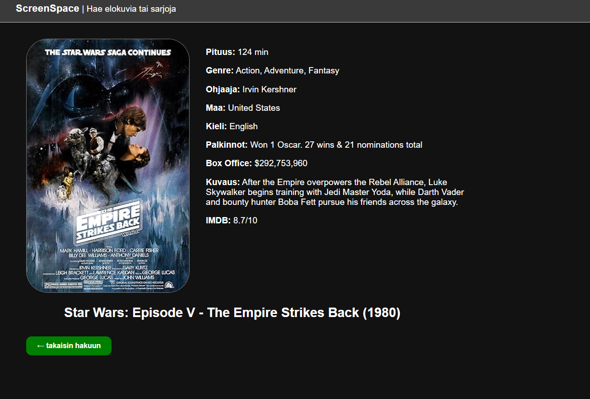

# Projekti 2: Ajax
Elokuvien ja sarjojen info sovellus / verkkosivu. 

Joachim Pehkonen, Joonas Sipilä

Verkkolinkit: Pääset julkaistuun sovellukseen käsiksi osoitteessa google.com Linkki projektin videoesittelyyn google.com

* Sovelluksen netlify linkki: 
https://project2-movieapp-ajax.netlify.app/ 

* Github linkki: 
https://github.com/JoachimPehkonen/Project-2-Ajax-Movie-Information-Movie-App

**Työn jakautuminen Miten työmäärä jaettiin? Kuka teki mitä? Miten yhteistyö sujui?**

Projektia tehtiin sovittuina aikoina, tehtävät jaettiin tasapuolisesti ja molemmat työstivät jaettujaa tehtäviä itsenäisesti ja tarvittaessa auttoivat toisia. Yhteistyö sujui erinomaisesti, eikä ollut ongelmia.

**Esimerkkejä tehdyistä tehtävistä**

Joonas: Suodata valikkojen tekeminen, DOM skriptausta ja Api kutsujen tekeminen ja näiden datojen
laittaminen eri muotoihin. haeElokuva funktion toiminnalisuuden työstämistä. Projektin visuaalisuuden tekemistä CSS tiedostoon sekä itse javascriptiin.

Joachim: Lisätietoja nappi + elokuvien ja sarjojen tietojen / javascriptin DOM skriptausta sekä Ajax kutsujen työstämistä. Arvostelija "suodattimen" työstämistä ja sen toiminnallisuuden "parantaminen". 

**Oma arvio työstä ja oman osaamisen kehittymisestä**

*Mielestäni onnistuin... Parantamista olisi... Sovelluksesta jäi puuttumaan... Koen, että olen oppinut... Epäselväksi jäi... Antaisin itselleni pisteitä seuraavasti: xx/yy p*

Joonaksen arvio ja kehittyminen: 

Mielestäni onnistuin projektin tekemisessä hyvin. Projekti alkoi vähä heikosti kun yritettiin ekana tehdä Finnkino elokuvateattereiden aikatauluja, mutta API-avain ei valitettavasti toiminut. Lopulta päädyimme tekemään omdb apia hyödytäen elokuvien ja sarjojen etsimispalvelu. Ongelmia silti esintyi projektissa, jos yritti tarkistella koodia kun molemmat työstivät projektia se oli vaikeaa, koska koodissa saatoi tällöin olla virhe kun toisella kesken vielä tekeminen.

Asiat, jossa onnistuin mielestäni: API kutsujen tekeminen sekä tämän datan hyödyntäminen ja DOM skriptaus.

Projektin paranataminen: Yleinen visuaalisuus ja toimminnot. Toimintoja enemmän ja nykyisiä parantaa ja yleinen visuaalisuus hienommaksi. 

Projektistä jäi puuttumaan erilaiset toiminnot kuten elokuvien/sarjojen järjestely julkaisuvuoden mukaan ja tallentaminen localstoragee omia elokuvia/sarjoja, josta näkisi kaikki katsottavat elokuvat. Valitettavasti aika ei riittäny näiden tekemiseen.3FCDA

Opin: Hyödyntämään dataa tekemistäni API kutsuista. Parannettua lisää DOM-skriptaus taitojani. Visuaalisuuden ymmärtämistä (CSS).

Arvosanaksi antaisin: Antaisin projektille 8-9 pistettä. Projektissa olisi voinut olla enemmän toimintoja, vaikka olen tyytyväinen nykyisiin toimintoihin myös. Ylipäätän mielestäni onnistuimme hyvin ja saimme tehtyä toimivan elokuva/sarja haku sovelluksen. Molemmat saivat tehtyä esittelyvideot ja palautuksen ajoissa.

Linkki Joonaksen video esittelyyn:

http://youtube.com/watch?v=XYIa5HkyphM

Joachimin arvio ja kehittyminen:

Työ onnistui kaikin puolin hyvin, vaikka samoihin ongelmiin törmättiin kuten ensimmäisessä projektissa, eli kun kaksi muokkaa JS-tiedostoa niin ei pysty kunnolla tarkastamaan toimivuutta. Toinen ongelma oli se, jos toinen painoi ctrl+z ja pyyhki jotain niin toisen muokkauksen meni samalla. Projekti alkoi ihan hyvin aikataulussa, mutta Finnkino uudisti sivunsa emmekä päässeet käsiksi heidän xml/API-sivuille, joten jouduimme hieman säätämään ja muokkaamaan ohjetta ja teimme siitä hieman omanlaisen tuolla omdb api:lla. 

Molemmat työstivät Leffaosion toiminnallisuutta, mutta minä tein mm. lisätietojen sisällön ja samaan syssyyn arvostelija suodattimen toiminnallisuuden kyseiseen kohtaan. Lisäksi olin vastuussa tehdä sarjaosion eli aikalailla ctrl+c + ctrl+v ja pienet hienosäädöt, jotta ohjelma toimisi. Molemmat työsti ja ideoi HTML-tiedostoa ja täyttivät CSS-tiedostoa. 

Parannettavaa olisi varmaankin yleisesti nettisivun tyylissä, se näyttää tällä hetkellä aika köykäiselle, mutta ajaa asiansa. Alkuperäinen idea mikä minulla oli, kun aloitimme tämän olisi ollut se, että värit olisi "matkineet" tai näyttäneet samalle kuten Finnkinolla, koska alkuperäinen idea oli tehdä Finnkinon leffaidea, mikä oli kurssin ohjeistuksessa. 

Parempi suodatus, koska nyt ei voi hakea kun vain kolmella arvostelijalla.

Haun olisi ehkä voinut tehdä yhteen hakukenttään, jonka jälkeen JavaScriptiin olisi voinut konfiguroida hieman selvemmin, mutta koska aikataulu painoi niskaan, niin piti tyytyä tälläiseen vaihtoehtoon.

Opin tekemään API kutsuja ja syventämään DOM skriptaus osaamistani lisäksi pääsi taistelemaan CSS tyylien kanssa.

Pisteitä antaisin varmaankin 9-10, varmaan vähemmän tippuu pisteitä jos ei tykkää sivun ulkonäöstä, mutta toiminnallisuus ja ymmärrys mielestäni tulee projektissa ilmi. Lisäksi teimme molemmat esittelyvideot ja projekti on palautettu ajoissa 13.11.2025 mennessä.

Linkki Joachimin video esittelyyn:

https://www.youtube.com/watch?v=LAAhG-3FCDA

**Molempien työtunnit:**
Työstimme projektia n. ~20, pyrimme tekemään projektia päivittäin 2-4 tuntia.

**Palaute opettajalle kurssista sekä itse opetuksesta tähän saakka**

Palautteemme ei ole muuttunut aiemmasta, vaikka pieni kömmähdys kävi kun yritimme kysyä sähköpostitse apua, saimme kuitenkin tukitunnilla tarvitsemamme avun ja pääsimme jatkamaan projektia.

Palautteemme on, että kurssi on ollut hyvin tehty ja oppimminen on ollut helppoa kurssimateriaalien avulla. Opettajalta on saanut helposti apua tarvittaessa ja selittänyt asiat selkeästi. Lähiopetus tunnit ovat olleet hyviä oppimisen kannalta.

**Sisällysluettelo:**

Tietoja sovelluksesta 
Tunnetut virheet/bugit 
Kuvakaappaukset 
Teknologiat 
Asennus 
Kiitokset ja lähteet 
Lisenssi

**Tietoja sovelluksesta**

Leffa/sarja ohjelma antaa käyttäjän hakea elokuvia tai sarjoja, jonka jälkeen käyttäjä saa tietää "perustiedot" kyseisestä sarjasta tai elokuvasta, kuten keston, kielen, tuotantomaa/minne sijoittuu, juoni jne... Käyttäjä voi hakea eri elokuvia tai sarjoja jolloinka vanhat hakutulokset katoavat. Lisäksi käyttäja voi suodattaa leffojen ja sarjojen arvostelijoita IMDB, Rotten Tomatoes ja Metacriticin väliltä, mutta jos haetulla leffalla tai sarjalla ei ole kyseiseltä arvostelijalta arvostelua, niin mitään ei ilmesty lisätiedot sivulle, arvostelijan kohdalle.

**Tunnetut virheet/bugit**

Jotkut julisteet ei saata näkyä, koska niitä ei löydy omdb API:sta, mutta muuten ohjelman pitäisi toimia normaalisti. Consolissa esiintyy jatkuvasti pari virhettä, jotka koskevat forms:ia, mutta tämä ei vaikuta toiminnallisuuteen, emmekä osaa sanoa miksi virhe ilmenee.

**Kuvakaappaukset Lisää tähän vähintään yksi kuvakaappaus toimivasta sovelluksesta:**

Kuva 1: "Etusivu"

Kuva 2: Leffaosion toiminnallisuus

Kuva 3: Sarjaosion toiminnallisuus

Kuva 4: Lisätiedot toiminnallisuus

Kuvat: Joonas Sipilä & Joachim Pehkonen

**Teknologiat**

Teknologioita, joita käytimme ovat html, css ja javascript. HTML käytimme projektin rakenteen luomiseen, CSS:ää sivuston visuaalisuuteen ja JavaScriptiä sivuston toiminnallisuuksiin, kuten elokuvan lisätietojen sisällön lisäämiseen.

**Asennus** 

Lyhyt ohje sovelluksen käynnistämiseen ja käyttöön. Esimerkiksi:

Käyttäjä voi ladata index.html, script.js ja style.css tiedostot omalle koneelle omaan kansioon ja sitten avata index.html tiedoston selaimessa.

Vaihtoehtoisesti käyttäjä voi käyttää netlify linkkiä, jotta hän pääsee suoraan verkkosivulle.

Tämän jälkeen kovaa ajoa ScreenSpace -ohjelman kanssa

**Kiitokset ja lähteet** 

Kiitokset kaikille katsojille!

Lista lähteistä ja esimerkeistä, joita käytit projektin aikana. Mainitse myös, jos käytit ChatGPT:tä tai muita tekoälytyökaluja koodauksen aikana ja kerro, miten ne auttoivat sinua.

W3Schools. 2025. JavaScript Fetch API. Viitattu 12.11.2025. https://www.w3schools.com/js/js_api_fetch.asp

DeepSeek. 2025. Viitattu 12.11.25. https://www.deepseek.com/en

OpenAI. 2025. ChatGPT (versio GPT-5). OpenAI. Viitattu 11.11.25. https://chatgpt.com/

ClaudeAI. 2025. Viitattu 22.10.2025. Viitattu 12.11.25. https://claude.ai/

Stenberg, M. 2025. Tiedon hakeminen Ajaxilla. GitBook.io. Viitattu 10.11.25. http://mika-stenberg.gitbook.io/web-sovelluksia-javascriptin-avulla/6.-ajax/tiedon-hakeminen-ajaxilla

Stenberg, M. 2025. Vastauksen parsiminen ja näyttäminen sivulla. GitBook.io. Viitattu 11.11.25. https://mika-stenberg.gitbook.io/web-sovelluksia-javascriptin-avulla/vastauksen-parsiminen-ja-nayttaminen-sivulla

Hyödynsimme myös W3schoolia ja kurssimateriaaleja.

Käytimme ChatGPT:tä, Claude:a ja DeepSeek tekoälyjä, mutta nämä yleensä tekivät enemmän haittaa kuin auttoivat. Käytettiin näitä enemmän virheiden etsimiseen ja korjaamiseen sekä visuaalisuuden parantamiseen. Deepseekiä hyödynsimme mm. kun piti saada tiedot esille Fetch API toiminnolla.

Projektin lisenssi:

MIT-lisenssi

Tekijänoikeus (c) 2025 Joonas Sipilä ja Joachim Pehkonen

Lupa myönnetään maksutta kenelle tahansa, joka saa kopion tästä ohjelmistosta ja siihen liittyvistä tiedostoista, käyttää, kopioida, muokata, yhdistää, julkaista, levittää, alilisensoida ja/tai myydä ohjelmistoa ilman rajoituksia, kunhan yllä oleva tekijänoikeus- ja lupailmoitus sisällytetään kaikkiin kopioihin.