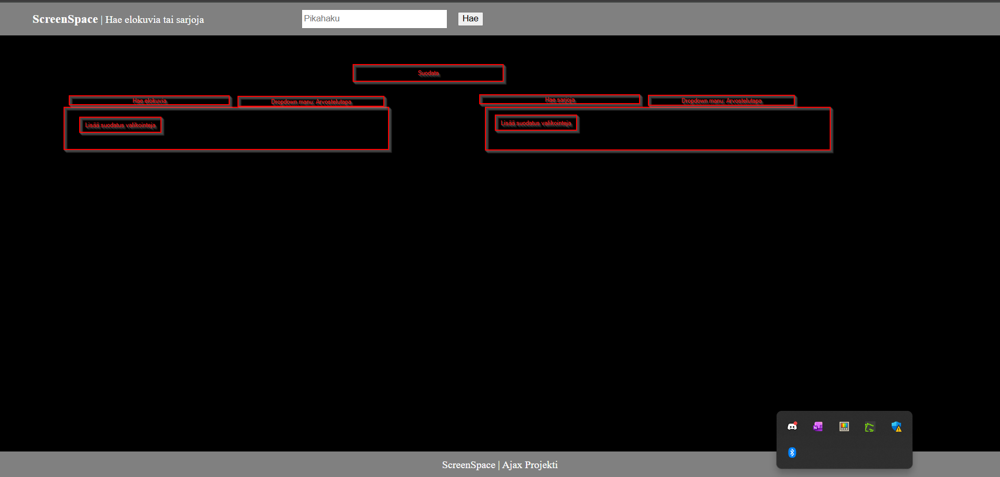

Finnkino teatterit XML
https://www.finnkino.fi/xml/TheatreAreas/

Finnkino aikataulut
https://www.finnkino.fi/xml/Schedule/ 

Implement a web page, where the user can select a movie from a list
The page then shows the pictures and info of the movies in the webpage
Display some other info as well, such as showtimes etc.
Create nice layout and style for the page
Extra points will be given for input field with custom search string
REST API can be found at:

https://www.omdbapi.com/

⦁	Rating
⦁	Kesto
⦁	Nimi
⦁	julkasuvuosi / pvm
⦁	kuva
⦁	kieli
⦁	box Office tuotot
⦁	Palkinnot
⦁	Juoni(?)
⦁	Genre
⦁	Tyyppi: onko leffa vai sarja

Links to an external site.
Open Movie DB can be found at: http://www.omdbapi.com/Links to an external site.

[1. Navigointi palkki] valmis
Hae katsottavaa!   [Pikahaku elokuvat tai sarjat] 

[2. Etusivun suodatapalkki]   
Suodata:
             Search bar         Dropdown_menu
Hae Elokuvia [Etsi_nimellä...] [Arviointi_tapa]    | Hae Sarjoja [Etsi_nimellä] [Arvionti_tapa]
                                 -> Rotten tomato
                                 -> IMBD
                                 -> Metacritic

[3. Etusivun footer]

2. [Elokuva tai sarja haettu näyttää kaikki tulokset.]

Star wars

[] Star wars New Hope
   Rating: 8.6

   Lue lisää..

[] Star Wars
   Julkaisuuosi
   Rating 8.1

   Lue lisää..

[3. Kun painetaan lue lisää avaa lisätietoa elokuvasta/sarjasta.]
New hope
[]          Plot
Julkaisuvuosi
Rating
kieli
genre

